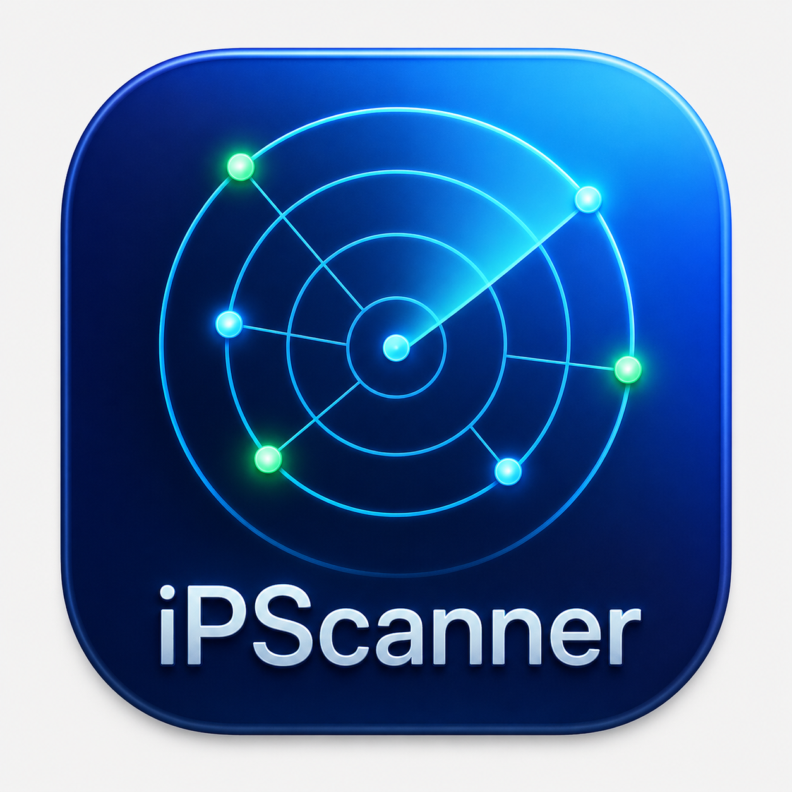
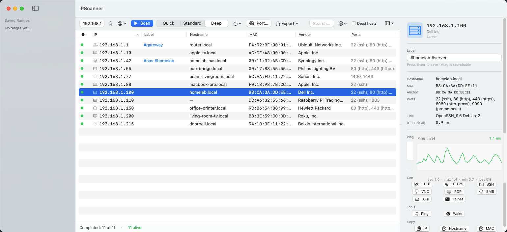
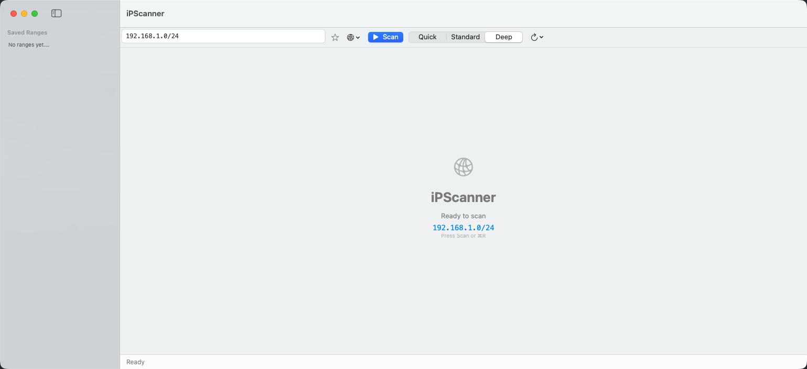

<div align="center">
  
  <h3><em>See every device on your network.</em></h3>
  <p>
    <a href="https://canberk.me/ipscanner/"></a>
    <a href="https://github.com/canberkys/iPScanner/releases/latest"></a>
    <a href="LICENSE"></a>
    
    
  </p>
</div>

---

# iPScanner — A native macOS network scanner

Open-source macOS counterpart to Advanced IP Scanner. Built with native SwiftUI, zero third-party dependencies, universal binary (Apple Silicon + Intel).

## Screenshots

<div align="center">
  
  <p><em>Scan results — table with vendors, ports, and labels; the right-side inspector shows the selected host's full detail and a live ping monitor.</em></p>
</div>

<div align="center">
  
  <p><em>Start screen — auto-detected default subnet, scan-profile picker (Quick / Standard / Deep), interface picker, auto-rescan menu, and the saved-ranges sidebar.</em></p>
</div>

---

## Installation

1. Download the latest `.dmg` from **[Releases](https://github.com/canberkys/iPScanner/releases/latest)**.
2. Open the `.dmg` and drag `iPScanner.app` into `Applications`.
3. On first launch, macOS Gatekeeper will refuse to run the app because it isn't signed with an Apple Developer ID. Pick **one** of the workarounds below.

<details>
<summary><strong>First launch — Gatekeeper workaround</strong></summary>

#### Option A — single command (recommended)

Strip every quarantine attribute the system added during download:

```bash
xattr -cr /Applications/iPScanner.app
```

This runs once and the app launches normally from then on.

#### Option B — UI route

1. Right-click `iPScanner.app` in Finder → **Open** → **Open**.
2. If that fails on macOS Sequoia (15) or Tahoe (26+), open **System Settings → Privacy & Security**, scroll to the *Security* section, and click **Open Anyway** next to "iPScanner was blocked".
3. macOS will prompt once more — click **Open**.

> ℹ️ iPScanner runs without sandboxing because network discovery requires direct ICMP / ARP / TCP socket access. All operations stay local — no telemetry, no third-party calls.

</details>

---

## Features

<details>
<summary><strong>Discovery</strong> — CIDR/range, ping, TCP fallback, ARP, OUI vendor (3-tier), mDNS, banners</summary>

- **CIDR + range input** — `10.0.0.0/24`, `192.168.1.50-192.168.1.200`, or comma-separated multiple ranges (`10.0.0.0/24, 172.16.0.0/24`)
- **Auto-detected default subnet** from the active interface (en0/en1)
- **Concurrent ping** (32 parallel) using `/sbin/ping`
- **TCP fallback probe** (445/80/443/22/3389) for hosts that block ICMP — Windows Firewall, etc.
- **Reverse DNS** with 1-second timeout (race-cancelable)
- **MAC address** via `arp -an` parsing
- **Vendor lookup** with the bundled IEEE OUI registry — MA-L (24-bit), MA-M (28-bit), and MA-S (36-bit) for sub-block accuracy
- **mDNS / Bonjour** service discovery (`_airplay`, `_homekit`, `_smb`, `_ssh`, `_ipp`, `_googlecast`, …)
- **HTTP / HTTPS title** and **SSH banner** fetch on demand (port-scan banner enrichment)

</details>

<details>
<summary><strong>Actions</strong> — port scanner, context menu, Wake-on-LAN, multi-select</summary>

- **Port scanner** — common-ports preset, web preset, custom ranges (`8000-8100`), bounded concurrency to avoid connection storms
- **Right-click context menu** per host: HTTP / HTTPS / SSH / VNC / RDP / SMB / AFP / Telnet / Ping in Terminal / Refresh / Wake-on-LAN / Copy IP/Hostname/MAC / Remove from list
- **Wake-on-LAN** — UDP magic packet, single host or bulk
- **⌘C** copies selected IP(s) from the table
- **Multi-select** for bulk actions

</details>

<details>
<summary><strong>Inspector</strong> — auto-opens on selection, ping monitor, action grid</summary>

Selecting a single host opens the right-side panel automatically. The panel is resizable and its width is persisted.

- Header — device-type icon, IP, vendor, classification
- Inline label editor with `#tag` syntax (searchable, MAC-anchored, persisted)
- Full info: hostname, MAC, anchor, open ports (with service names), service title, RTT
- mDNS services list
- Live ping monitor — sparkline + avg / min / max / loss stats (1s interval, 60-sample buffer)
- Action grid grouped into Connect / Tools / Copy

</details>

<details>
<summary><strong>v1.1 additions</strong> — scan profiles, interface picker, auto-rescan, snapshot diff, search highlighting, warnings hub</summary>

- **Scan profiles** — *Quick* (ping only) / *Standard* (+ TCP fallback) / *Deep* (+ auto port scan & banner fetch on alive hosts)
- **Network interface picker** — choose `en0` / `en1` / `utun` (VPN) from a menu; subnet auto-fills
- **Auto-rescan** — off / 30 s / 1 m / 5 m / 15 m, kicks in after the previous scan finishes
- **Change detection / snapshot diff** — load a previous `.ipscan.json` as comparison baseline; per-row badges (`+` new, `~` changed, `−` missing) plus a summary popover listing missing hosts
- **Permission/failure surfacing** — status-bar warnings hub (ARP table empty, banner fetch failures) with a click-through detail popover
- **Search match highlighting** — query substrings highlighted in IP / Hostname / MAC / Vendor / Title / Label cells
- **Resizable inspector** — drag the divider; width persisted

</details>

<details>
<summary><strong>Persistence & I/O</strong></summary>

- **Saved ranges** with friendly names (`Home`, `Office VLAN`) — sidebar with rename support
- **Snapshot save/load** — `.ipscan.json`, ⌘O / ⌘⌥S
- **Export** as CSV / JSON / clipboard
- Per-host labels persisted in `UserDefaults`

</details>

<details>
<summary><strong>UX</strong> — split view, app menus, appearance picker, status bar</summary>

- macOS-native: `NavigationSplitView` (sidebar + detail + inspector), `ContentUnavailableView`, App-menu commands, custom About panel, GitHub Help menu
- **Appearance picker** in `View → Appearance` (System / Light / Dark)
- **Live updates** — alive hosts stream into the table as they're discovered
- **Status bar** — progress, alive count, filter match, elapsed time, warnings, diff summary
- Sandbox disabled (required for ICMP / ARP / raw socket access)

</details>

---

## Command-line interface (`ipscanner`)

The same scanning engine is exposed as a headless `ipscanner` binary inside the app bundle, suitable for cron jobs, `launchd`, or piping into other tools.

```bash
# Discover hosts on a subnet, write JSON to a file
/Applications/iPScanner.app/Contents/MacOS/ipscanner 10.0.0.0/24 \
  --profile standard --format json --output scan.json

# Scan a target list from CSV with port scan + banner fetch, emit ip:port lines
/Applications/iPScanner.app/Contents/MacOS/ipscanner \
  --input targets.csv --ports 22,80,443 --fetch-banners --format ip-port

# Quick (ICMP-only) scan to stdout
/Applications/iPScanner.app/Contents/MacOS/ipscanner 192.168.1.0/24 --profile quick --format txt
```

Run `--help` for the full flag list. Exit codes: `0` success, `1` argument / input error, `2` runtime / scan error.

For convenience you can symlink it onto your `PATH`:

```bash
sudo ln -s /Applications/iPScanner.app/Contents/MacOS/ipscanner /usr/local/bin/ipscanner
```

---

## Build from source

**Requirements**: macOS 14.4+, Xcode 15+, [xcodegen](https://github.com/yonki/xcodegen)

```bash
brew install xcodegen
git clone https://github.com/canberkys/iPScanner.git
cd iPScanner
xcodegen generate
open iPScanner.xcodeproj
# Cmd+R to build and run
```

<details>
<summary>OUI databases & tests</summary>

The IEEE OUI databases (`oui.txt`, `oui28.txt`, `oui36.txt`) are bundled in the repo. The release CI workflow refreshes them from `standards-oui.ieee.org` on every tag push.

```bash
xcodebuild test -scheme iPScanner -destination 'platform=macOS'
```

85+ unit tests cover the parsers (CIDR/range, ports), OUI 3-tier vendor lookup, CSV escaping, snapshot encode/decode, snapshot diff, device classifier, and saved-range model.

</details>

---

## Roadmap

<details>
<summary><strong>v1.0 — completed</strong></summary>

- [x] Multi-range scan input
- [x] TCP fallback probe (ICMP-blocked hosts)
- [x] mDNS / Bonjour discovery
- [x] Wake-on-LAN
- [x] Saved ranges with names + Rename
- [x] Snapshot save/load (`.ipscan.json`)
- [x] Per-host labels (MAC-anchored, `#tag` searchable)
- [x] Live ping monitor in inspector
- [x] Service-name column for ports (22 → ssh, 9100 → printer, …)
- [x] HTTP title / SSH banner enrichment
- [x] OUI MA-L + MA-M + MA-S (sub-block accuracy)
- [x] App-menu commands + keyboard shortcuts
- [x] Appearance picker (System / Light / Dark)

</details>

<details>
<summary><strong>v1.1 — completed</strong></summary>

- [x] Scan profiles — Quick / Standard / Deep
- [x] Network interface picker
- [x] Auto-rescan
- [x] Change detection / snapshot diff
- [x] Permission/failure surfacing
- [x] Search match highlighting
- [x] Resizable inspector

</details>

### v1.2.0 — Operations focus

Aimed at moving iPScanner from a desktop tool to a usable operations tool.

- [ ] **File import** — read targets from `.txt` / `.csv` (IP, hostname, CIDR, range), dedupe, surface invalid lines
- [ ] **TTL column** — parsed from `/sbin/ping` output, optional column, included in CSV/JSON export
- [ ] **IP:Port list export** — flat `ip:port` lines for piping into Nmap, firewall rules, scripts
- [ ] **TXT report export** — human-readable summary suitable for tickets and email
- [ ] **Scan engine extraction** — split a UI-independent `ScanEngine` out of `ScanController`; reused by both the app and the CLI
- [ ] **`ipscanner` CLI** — headless scan with `--input`, `--ports`, `--profile`, `--format json|csv|txt|ip-port`, `--output`, exit codes for automation

### v1.2.1 — Enterprise enrichment

- [x] **NetBIOS name fetcher** — UDP 137 query for Windows host name / workgroup when DNS is stale
- [x] **Subnet calculator popover** — `/N` to network/broadcast/host-count, useful inline tool
- [x] **In-app update check** — periodic GitHub Releases API check, alert with View Release / Skip / Later, manual `Help → Check for Updates…`
- [ ] **Notarized release** — Apple Developer ID signature, removes the Gatekeeper friction documented in [Installation](#installation)

### v1.3 — Persistent operations

- [ ] **launchd-backed scheduled scans** — true background scans even when the app is closed (in-memory auto-rescan stays as the foreground equivalent)
- [ ] **History / time-series** — long-term per-host first-seen / last-seen / port-state tracking on top of the existing snapshot model

<details>
<summary><strong>Deferred (P2)</strong> — open to demand, not on the active list</summary>

- Multi-ping at scan time with packet-loss percentage (live inspector already covers the diagnostic case; 3× scan time is rarely worth it)
- Filtered-port detection (`open` / `closed` / `filtered` distinction; risk of mis-classification on TCP timeout)
- XML export
- Append-to-file export mode (snapshot diff is the cleaner historical model)

</details>

<details>
<summary><strong>Out of scope</strong> — explicit non-goals</summary>

- Public plugin API. Internal protocols (`TargetProvider`, `HostEnricher`, `ScanExporter`) keep the codebase clean without committing to a stable extension contract.
- Random IP feeder (Angry IP Scanner-style). Doesn't match the operational use case and invites misuse.
- HTTP proxy detection / arbitrary HTTP sender. Out of scope for a discovery tool; covered better by `curl`.
- Menu-bar mode with new-device notifications. CLI + `launchd` is the more flexible path for the same goal.
- IPv6 support. Niche for typical macOS LAN discovery; will reconsider on user demand.

</details>

---

## Tech stack

SwiftUI (macOS 14.4+, `@Observable`, `NavigationSplitView`) · Swift Concurrency (`async/await`, `TaskGroup`, `AsyncStream`) · Network framework (`NWConnection`, `NWBrowser`) · `Process` for `/sbin/ping`, `/usr/sbin/arp` · zero third-party Swift packages.

---

## License

MIT — see [LICENSE](LICENSE).

Vendor data from the [IEEE Standards Association OUI registries](https://standards-oui.ieee.org/) (public).

## Author

**Canberk Kılıçarslan** — [canberkki.com](https://canberkki.com)

Feedback, bug reports, and pull requests welcome via [Issues](https://github.com/canberkys/iPScanner/issues).
